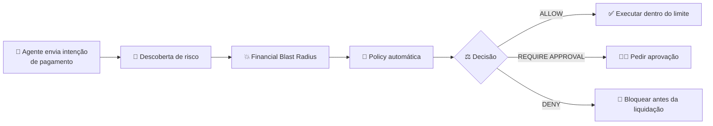
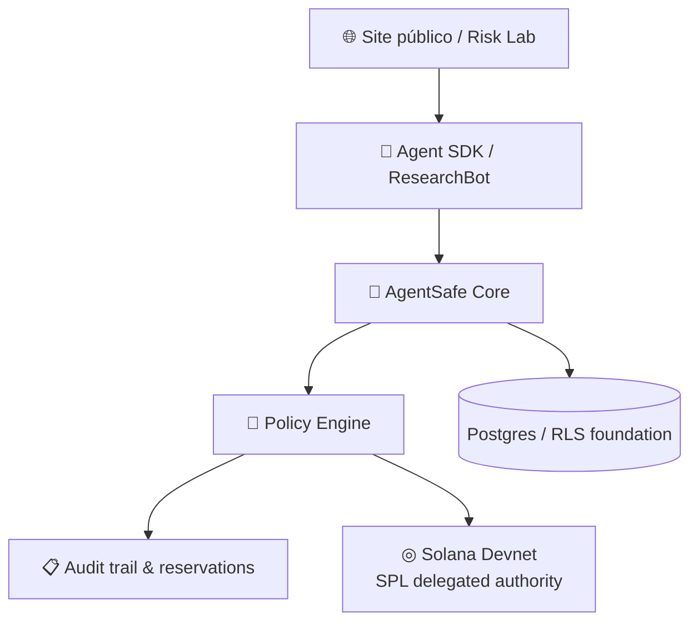
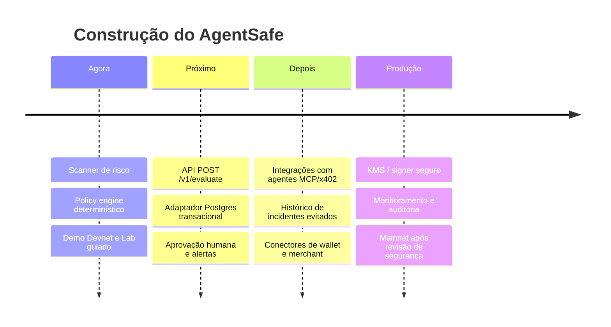

<div align="center">

# Agent<span style="color:#55e4a5">Safe</span>

### Financial Risk Engine for AI Agents

**Descubra quanto um agente pode perder, limite sua autoridade e impeça gastos fora da policy.**

[](https://solana.com)
[](https://www.typescriptlang.org/)
[](#-status-atual)

[🌐 Abrir demo pública](https://agentsafe-risk-lab.anacavalcanteamorim1.chatgpt.site/) · [📦 Ver código](#-arquitetura) · [🧪 Testar Devnet](docs/DEMO_GUIDE.md) · [🗺️ Ver roadmap](#-roadmap)

</div>

---

## O problema

Agentes de IA já conseguem pesquisar, assinar serviços e executar pagamentos. O problema não é apenas “o agente pode errar”: é **qual o tamanho financeiro desse erro agora?**

Sem controles, o saldo total da carteira vira a exposição potencial. AgentSafe troca essa confiança cega por uma autoridade explícita, explicável e tecnicamente limitada.

> **Não basta confiar que o agente obedecerá. Ele precisa ser incapaz de gastar além da autoridade recebida.**

## O que o AgentSafe faz



| Descobre | Limita | Impede |
| --- | --- | --- |
| orçamento ausente | valor por transação | autoridade delegada |
| loop de retries pagos | orçamento por tarefa | execução fora da policy |
| preço anômalo | limite diário | gasto acima do allowance |
| merchant/destinatário novo | destinatários permitidos | liquidação indevida |

## A demo em 30 segundos

<div align="center">

| Antes | AgentSafe | Depois |
| :---: | :---: | :---: |
| 🔓 **US$ 10.000**<br/>exposição sem limites | 🔎 scanner + policy<br/>⚖️ decisão determinística | 🔐 **US$ 20/dia**<br/>autoridade máxima |

</div>

O `ResearchBot` recebe uma tarefa de pesquisa e tenta comprar dados. A análise encontra riscos que o usuário não configurou manualmente, gera uma policy e testa uma tentativa acima da regra.

```json
{
  "maxPorTransacao": "US$ 2,00",
  "maxPorTarefa": "US$ 3,00",
  "maxPorDia": "US$ 20,00",
  "novoDestinatario": "BLOQUEAR",
  "retriesPagos": 3
}
```

## Prova on-chain: Solana Devnet

Esta não é apenas uma interface de limites.

| Cenário | Resultado | Evidência |
| --- | --- | --- |
| Treasury cria `100 test-USDC` | saldo disponível | carteira do usuário mantém o cofre |
| AgentSafe recebe allowance de `20 test-USDC` | autoridade limitada | delegated authority via SPL Token |
| Pagamento de `US$ 0,55` | ✅ permitido | [ver transação](https://explorer.solana.com/tx/551XvfHzYHSH7pv2kysTqaevVy3ArCaW6eCLF5VB6CdRMLJBQpegdz2A1sLxqc9MviypwRsmJTbrZodELVQ4v7Ht?cluster=devnet) |
| Tentativa de `US$ 21` | 🛑 recusada antes da liquidação | excede a autoridade delegada |

**O insight:** mesmo que existam 100 tokens no cofre, o agente não consegue gastar 21 se recebeu autoridade para 20.

→ [Guia completo para reproduzir a demo](docs/DEMO_GUIDE.md)

## Arquitetura



<details>
<summary><b>Componentes no repositório</b></summary>

| Área | Onde está | Responsabilidade |
| --- | --- | --- |
| Core de domínio | [`src/`](src/) | intents, dinheiro em unidades inteiras, policy e decisões |
| Risco e blast radius | [`src/risk-score.ts`](src/risk-score.ts), [`src/blast-radius.ts`](src/blast-radius.ts) | cálculo explicável de exposição |
| Policy engine | [`src/policy-engine.ts`](src/policy-engine.ts) | `ALLOW`, `DENY`, `REQUIRE_APPROVAL` |
| Policy generator | [`src/policy-generator.ts`](src/policy-generator.ts) | limites derivados dos sinais encontrados |
| Prova Solana | [`src/solana-allowance.ts`](src/solana-allowance.ts) | allowance e teste de fronteira em Devnet |
| Demo pública | [`apps/public-site/`](apps/public-site/) | apresentação em português e Lab guiado |
| Banco/RLS | [`db/migrations/`](db/migrations/) | base para multi-tenancy e auditoria |

</details>

## Como testar

### Demo guiada, sem carteira

1. Abra a [demo pública](https://agentsafe-risk-lab.anacavalcanteamorim1.chatgpt.site/).
2. Clique em **“Analisar ResearchBot”**.
3. Confira riscos, policy e o teste de bloqueio de `US$ 14,00`.

### Prova Devnet, com Phantom

1. Use **uma única** carteira Phantom em modo **Devnet** e tenha um pouco de Devnet SOL para taxas.
2. Na seção Solana Devnet: conectar → criar demo de 20 USDC → permitir US$ 0,55 → tentar US$ 21.
3. A última tentativa deve falhar; tokens não são movidos no bloqueio.

> O Lab usa tokens de teste e uma identidade temporária. Nunca pede seed phrase ou chave privada.

Veja também: [passo a passo detalhado](docs/DEMO_GUIDE.md).

## Status atual

| Capacidade | Status |
| --- | :---: |
| Descoberta determinística de riscos | ✅ |
| Financial Blast Radius | ✅ |
| Policy automática explicável | ✅ |
| Decisões `ALLOW` / `DENY` / `REQUIRE_APPROVAL` | ✅ |
| Reservas e idempotência no core | ✅ |
| Demo guiada em português | ✅ |
| Prova de delegated authority em Solana Devnet | ✅ |
| API autenticada e persistência de produção | 🧭 próximo passo |
| Mainnet e custódia/KMS de produção | ⛔ fora do MVP |

## Roadmap



## Princípios de produto

- **Não somos uma wallet.** Somos a camada de inteligência e autoridade financeira.
- **Policy como artefato.** Toda recomendação precisa explicar seu limite e sua evidência.
- **Enforcement acima de confiança.** O agente não deve conseguir ignorar uma decisão.
- **Segurança honesta.** Devnet é prova de conceito; mainnet requer revisão, KMS e observabilidade.

## Desenvolvimento local

```bash
# Core TypeScript
npm ci
npm run check
npm run demo:researchbot

# Site público
cd apps/public-site
npm ci
npm run build
```

## Documentação

- [Roteiro e teste da demo](docs/DEMO_GUIDE.md)
- [Mapa do projeto](docs/PROJECT_MAP.md)
- [Detalhes de enforcement Devnet](docs/DEVNET_ENFORCEMENT.md)
- [Estado de implementação](docs/IMPLEMENTATION_STATUS.md)
- [Decisão de escopo: AgentSafe não é wallet](docs/ADR-0001-product-boundary.md)

---

<div align="center">

**AgentSafe encontra como agentes falham. AgentSafe limita quanto essa falha pode custar.**

Feito para a nova era de agentes financeiros em Solana.

</div>
