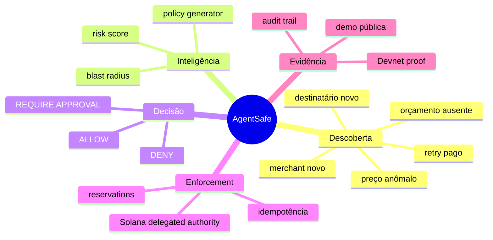

# Mapa do projeto AgentSafe

## Fluxo principal

## Regras de escopo

O AgentSafe não substitui uma carteira, processador de pagamento ou custodiador. Ele se posiciona acima dessas camadas para:

1. descobrir risco;
2. definir uma autoridade mínima;
3. decidir antes da execução;
4. reforçar a decisão com a primitive disponível.

## O que vem depois

| Prioridade | Entrega | Resultado esperado |
| --- | --- | --- |
| 1 | API autenticada de avaliação | agentes conseguem consultar o motor de risco em tempo real |
| 2 | Repositório Postgres | decisões e reservas persistentes, isoladas por workspace |
| 3 | Aprovação humana | ações de risco médio seguem um fluxo verificável |
| 4 | Integrações de pagamento | enforcement em conectores reais, sem virar payment rail |
| 5 | Dataset de falhas | heurísticas e políticas melhores ao longo do tempo |
